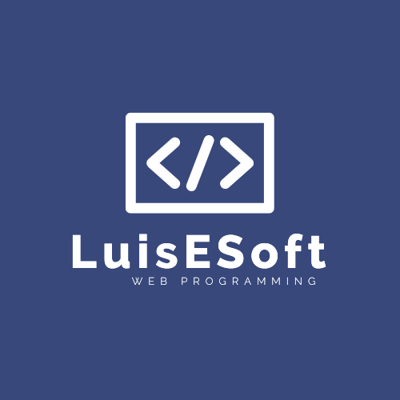

<a name="readme-top"></a>

<!--
HOW TO USE:
This is an example of how you may give instructions on setting up your project locally.

Modify this file to match your project and remove sections that don't apply.

REQUIRED SECTIONS:
- Table of Contents
- About the Project
  - Built With
  - Live Demo
- Getting Started
- Authors
- Future Features
- Contributing
- Show your support
- Acknowledgements
- License

After you're finished please remove all the comments and instructions!
-->

<div align="center">

  
  <br/>

  <h3><b>My new Blog</b></h3>

</div>

<!-- TABLE OF CONTENTS -->

# 📗 Table of Contents

- [📖 About the Project](#about-project)
  - [🛠 Built With](#built-with)
    - [Tech Stack](#tech-stack)
    - [Key Features](#key-features)
  - [🚀 Live Demo](#live-demo)
- [💻 Getting Started](#getting-started)
  - [Setup](#setup)
  - [Prerequisites](#prerequisites)
  - [Install](#install)
  - [Usage](#usage)
  - [Run tests](#run-tests)
  - [Deployment](#triangular_flag_on_post-deployment)
- [👥 Authors](#authors)
- [🔭 Future Features](#future-features)
- [🤝 Contributing](#contributing)
- [⭐️ Show your support](#support)
- [🙏 Acknowledgements](#acknowledgements)
- [❓ FAQ](#faq)
- [📝 License](#license)

<!-- PROJECT DESCRIPTION -->

# 📖 My new Blog <a name="about-project"></a>

> Hello Microvers, I created it using HTML, CSS

## 🛠 Built With <a name="built-with"></a>

1-HTML.
2-CSS.
3-Liners.

### Tech Stack <a name="tech-stack"></a>

<details>
  <summary>Client</summary>
  <ul>
    <li><a href="https://reactjs.org/">HTML</a></li>
    <li><a href="https://reactjs.org/">CSS</a></li>
  </ul>
</details>

<!-- Features -->

### Key Features <a name="key-features"></a>

-Added index.html file.
-Added style.css file.

<p align="right">(<a href="#readme-top">back to top</a>)</p>

<!-- LIVE DEMO -->

## 🚀 Live Demo <a name="live-demo"></a>

Comming soon!!!

<p align="right">(<a href="#readme-top">back to top</a>)</p>

<!-- GETTING STARTED -->

## 💻 Getting Started <a name="getting-started"></a>

It Will be great for you and your friends!!!

To get a local copy up and running, follow these steps.

### Prerequisites

1-Web browser.
2-Code Editor.
3.Git-smc.

### Setup

Clone this repository to your desired folder:

Run this commands:

```sh
  cd my-folder
  git clone https://github.com/lerfast/my-new-blog.git
```

### Install

Install this project with:

Run command:

```sh
  cd my-project
  npm install
```

### Usage

To run the project, execute the following command:

Open index.html using live server extension.

### Run tests

Comming soon!!!

### Deployment

Comming soon!!!

<p align="right">(<a href="#readme-top">back to top</a>)</p>

<!-- AUTHORS -->

## 👥 Authors <a name="authors"></a>

👤 Luis Emilio Rojas

- GitHub: [@githubhandle](https://github.com/lerfast)
- Twitter: [@twitterhandle](https://twitter.com/lerfast)
- LinkedIn: [LinkedIn](https://www.linkedin.com/in/luis-emilio-rojas-rojas-6ba90a8a/)

<p align="right">(<a href="#readme-top">back to top</a>)</p>

<!-- FUTURE FEATURES -->

## 🔭 Future Features <a name="future-features"></a>

- [ ] Add Header.
- [ ] Add more styles.

<p align="right">(<a href="#readme-top">back to top</a>)</p>

<!-- CONTRIBUTING -->

## 🤝 Contributing <a name="contributing"></a>

Contributions, issues, and feature requests are welcome!

Feel free to check the [issues page](../../issues/).

<p align="right">(<a href="#readme-top">back to top</a>)</p>

<!-- SUPPORT -->

## ⭐️ Show your support <a name="support"></a>

If you like this project just give it a star ⭐

<p align="right">(<a href="#readme-top">back to top</a>)</p>

<!-- ACKNOWLEDGEMENTS -->

## 🙏 Acknowledgments <a name="acknowledgements"></a>

I would like to thank Microverse.

<p align="right">(<a href="#readme-top">back to top</a>)</p>

<!-- LICENSE -->

## 📝 License <a name="license"></a>

This project is [MIT](./LICENSE) licensed.

<p align="right">(<a href="#readme-top">back to top</a>)</p>
